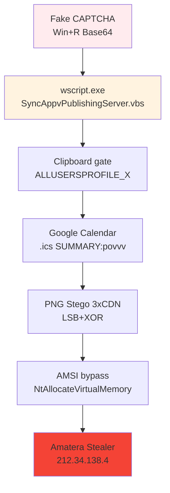

# FakeCAPTCHA-Amatera-2026-

# 🚨 Fake CAPTCHA → Amatera Stealer (Enero 2026)

**Análisis completo** de la campaña Blackpoint SOC: Fake CAPTCHA → App-V LOLBIN → Google Calendar C2 → PNG Steganography → Amatera Stealer.

## 🎯 Kill Chain

Resumen Ejecutivo
Campaña MaaS enterprise-grade identificada por Blackpoint SOC. 4 variantes activas (boom/nim5/CDN/bdedc647) comparten cadena común: Fake CAPTCHA → App-V LOLBIN → execution gates → Google Calendar C2 → PNG steganography → Amatera Stealer.

Hashes PRINCIPALES completos:

text
boom:                                    c64529646839be71fdfa7261cd2f3b5e6fac929d53341dd134793a7194b2d433
nim5:                                    25b77cacec19302d81a44fdeccf1fed9ff117aee3d7ca262a46d2c90f9aca42b
CDN sample.bin:                          7537cb0e719d9d0609eee7910542e877eae032707cbc15cfbd4c758f0040861f
bdedc647_b12.txt:                        0bcad4e8bfeebdb7b504c500db037c8930b3d69c53940002d3da395374c6f671
herf54 loader:                           b61fe68f0b1bef12eed8a34769120d77579af9d3c529ac48dfe82a08eefa001b
Google Calendar basic.ics:               64d723ead9b43a049f9c8e23c8d4ec09ffabeac2d9b079c863c89a4aab7c9a45
PNG stego container:                     bbfc4b48676aa78b5f18b50e733837a94df744da329fe5b1b7ba6920d9e02dc3
Amatera PE shellcode:                    18dad9cb91fb97a817e00fa0cd1cb9ab59f672b8ddab29f72708787f19bf6aa1
C2 final: 212.34.138.4 (Host header spoofing: cdn.extremevideos.com)

Kill Chain Completa (7 Fases)
text
1. FAKE CAPTCHA → Win+R comando Base64 Unicode
   └── new-alias iex Invoke-Expression → herf54/nim5/sample.bin
   
2. wscript.exe → SyncAppvPublishingServer.vbs (App-V LOLBIN)
   └── SOLO Enterprise/Education Win10/11
   
3. CLIPBOARD GATE + anti-análisis
   └── ALLUSERSPROFILE_X validation
   └── RAM check (>2GB), archivo fantasma C:\NonExistentPath\781.cfg
   
4. GOOGLE CALENDAR C2 (.ics SUMMARY:povvv)
   └── sec-t2.fainerkern.ru → MD5 victim subdomain → svc-int-api-identity-token-issuer-v2-mn.in.net
   
5. PNG STEGANOGRAPHY (3x CDN redundancia)
   └── gcdnb.pbrd.co | iili.io | s6.imgcdn.dev
   └── LSB extraction → XOR(s8YUKQ0CqUd6HNwGSRDZ%Qpux1N9MKHh) → GZip PS1
   
6. AMSI BYPASS + shellcode staging
   └── XOR key: AMSI_RESULT_NOT_DETECTED
   └── NtAllocateVirtualMemory → Amatera PE
   
7. C2 212.34.138.4 (SSPI + WoW64 syscalls)
   └── Host: cdn.extremevideos.com
   
Variantes Mapeadas

boom	c64529646839be71fdfa7261cd2f3b5e6fac929d53341dd134793a7194b2d433	
nim5	25b77cacec19302d81a44fdeccf1fed9ff117aee3d7ca262a46d2c90f9aca42b	
CDN	7537cb0e719d9d0609eee7910542e877eae032707cbc15cfbd4c758f0040861f	
bdedc647	0bcad4e8bfeebdb7b504c500db037c8930b3d69c53940002d3da395374c6f671

Fingerprint común: new-alias iex + SyncAppvPublishingServer.vbs + Data_Value_824

Payload Simulator Funcional Completo
AmateraPayloadSimulator.ps1:
